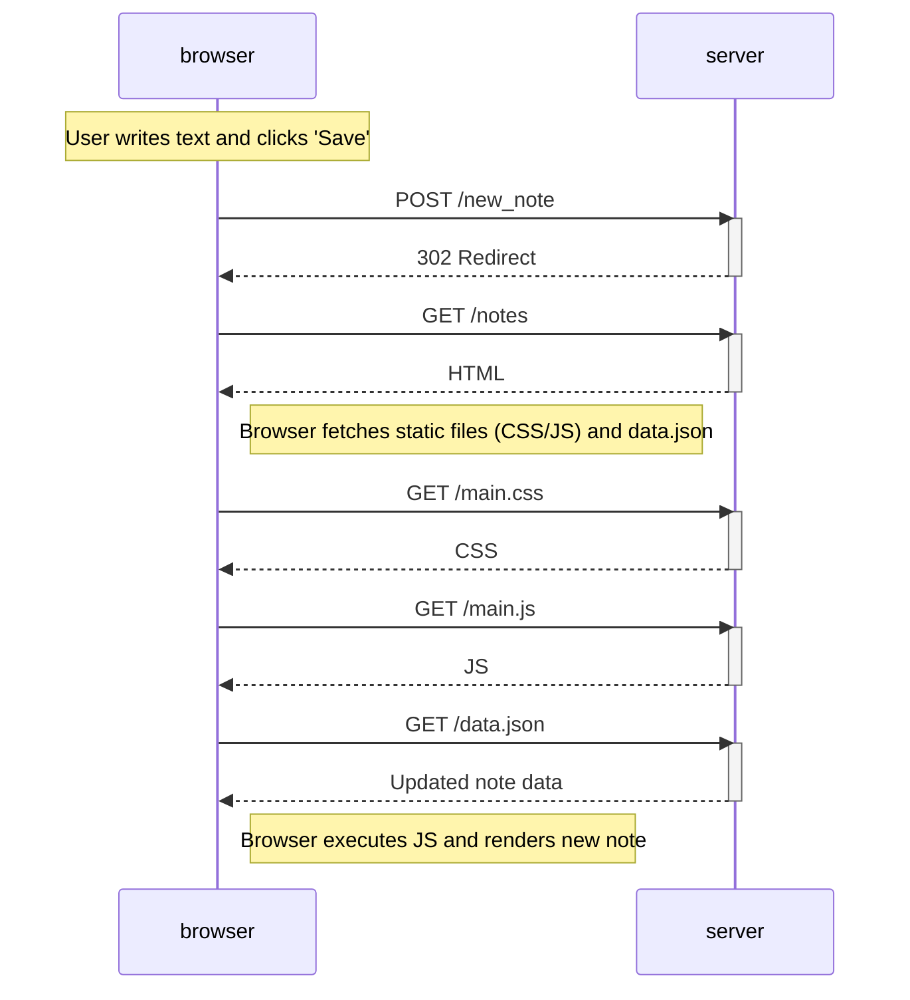

```mermaid
sequenceDiagram
    participant browser
    participant server
    Note over browser: User writes text and clicks 'Save'
    browser->>server: POST /new_note
    activate server
    server-->>browser: 302 Redirect
    deactivate server
    browser->>server: GET /notes
    activate server
    server-->>browser: HTML
    deactivate server
    Note right of browser: Browser fetches static files (CSS/JS) and data.json
    browser->>server: GET /main.css
    activate server
    server-->>browser: CSS
    deactivate server
    browser->>server: GET /main.js
    activate server
    server-->>browser: JS
    deactivate server
    browser->>server: GET /data.json
    activate server
    server-->>browser: Updated note data
    deactivate server
    Note right of browser: Browser executes JS and renders new note
```